 

# Online Shop Management System 
The Online Shop Management System Database is designed to efficiently manage customers, products, orders, and payments in an online shopping environment. It demonstrates essential database functionalities such as customer management, product catalog management, order processing, and payment tracking using MySQL. This project provides a foundational understanding of how online shopping systems store, organize, and retrieve information through a relational database model.

---

## Project Overview

The Online Shop Management System comprises four interrelated tables — **customers, products, orders**, and **payments**. These tables collectively simulate the main operations of an online shopping system including customer registration, product management, order placement, and payment processing.

The design emphasizes referential integrity, relationships between tables, and data organization, making it suitable for learning and small-scale online shop database management.

---

## Key Objectives

### 1. Customer Management

Store and maintain customer information such as customer ID, name, email, phone number, and address.

### 2. Product Management

Maintain product details including product ID, product name, category, price, and available stock.

### 3. Order Management

Record customer orders along with the ordered product, quantity, order date, and total amount.

### 4. Payment Management

Track payment information associated with each order, including payment method, payment amount, payment date, and payment status.

### 5. Data Query & Reporting

Use SQL queries to analyze customer orders, product sales, payment information, total spending, and stock details.

---

## Tools & Technologies Used

**MySQL** – Database Management System

**SQL**– Query Language for data handling

---

## Database Design

### **1. Customers Table**
| Column        | Type			| Description								|
|---------------|---------------|-------------------------------------------|
|customer_id	| INT			| Primary Key – Unique customer identifier  |
|customer_name	| VARCHAR(50)	| Customer name								|
|email		    | VARCHAR(100)	| Customer email address					|
|phone		    | VARCHAR(15)	| Customer contact number					|
|address	    | VARCHAR(100)	| Customer residential address				|

### **2. Products Table**
| Column		| Type			| Description								|
|---------------|---------------|-------------------------------------------|
|product_id		| INT			| Primary Key – Unique product identifier	|
|product_name	| VARCHAR(100)	| Name of the product						|
|category		| VARCHAR(50)	| Product category							|	
|price			| DECIMAL(10,2)	| Price of the product						|
|stock			| INT			| Available quantity in stock				|

### **3. Orders Table**
|Column			| Type			| Description									 |
|---------------|---------------|------------------------------------------------|
|order_id		| INT			| Primary Key – Unique order identifier			 |
|customer_id	| INT			| Foreign Key references customers(customer_id)  |
|product_id		| INT			| Foreign Key references products(product_id)	 |
|quantity		| INT			| Quantity of product ordered					 |
|order_date		| DATETIME		| Date and time of the order					 |
|total_amount	| DECIMAL(10,2)	| Total amount of the order						 |

### **4. Payments Table**
|Column			| Type			| Description								|
|---------------|---------------|-------------------------------------------|
|payment_id		| INT			| Primary Key – Unique payment identifier	|
|order_id		| INT			| Foreign Key references orders(order_id)	|
|payment_method	| VARCHAR(30)	| Payment method such as UPI, Card, or Cash	|
|payment_amount	| DECIMAL(10,2)	| Amount paid for the order					|
|payment_date	| DATETIME		| Date and time of payment					|
|payment_status	| VARCHAR(20)	| Status of payment such as Paid or Pending	|

---

## ER Diagram

  

---

## Project Results
[Click here to get full code](https://github.com/gaikwadshweta263-commits/Online-Shopping-System/tree/c2d15ce09236d96d39bc514e3f7541b637dd59b1/database)

---

## SQL Query Tasks

### 1.Retrieve all customer names who have placed an order with a total amount greater than 2,000. 

Query:
select * from customers where customer_id =(select customer_id from orders where total_amount>2000);

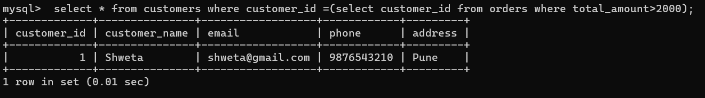 &nbsp;

---

### 2.Display product name, category, and price of all Electronics products. 
Query:
select product_name,category,price from products where category='electronics';

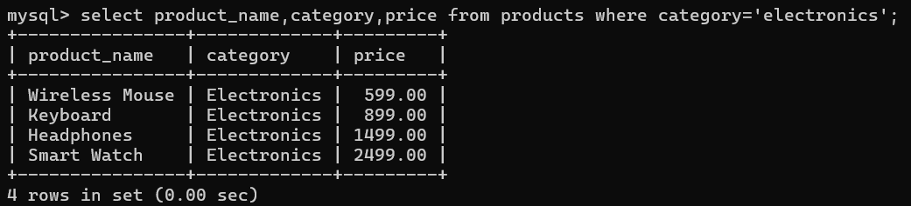 &nbsp;

---

### 3.Display the customers who live in Pune.
Query:
select * from customers where address = 'pune';

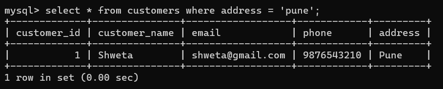 &nbsp;

---

### 4.Display the customers who live in Wakad.
Query:
select * from customers where address = 'wakad';

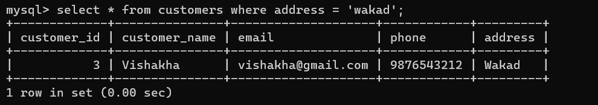 &nbsp;

---

### 5. Retrieve products whose price is greater than 1000.
Query:
select product_id, product_name, price from products where price > 1000;

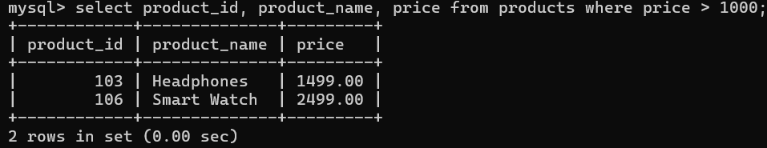 &nbsp;

---

### 6. Display products having stock greater than 15.
Query:
select product_name, stock from products where stock > 15;

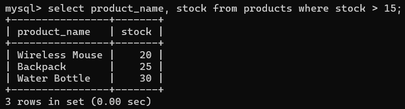 &nbsp;

---

### 7. Display the products with price between 500 and 1500.
Query:
select product_name, price from products where price between 500 and 1500;

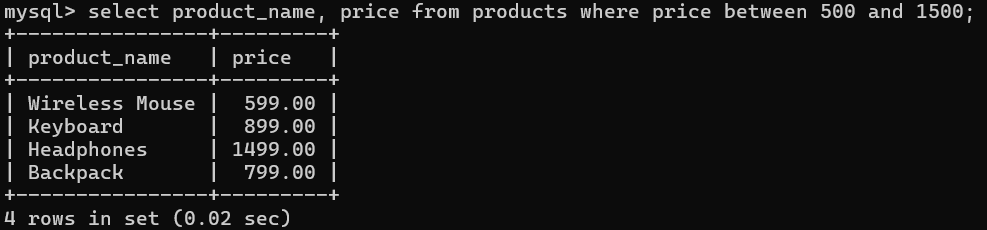 &nbsp;

---

### 8. Display products in descending order of price.
Query:
select * from products order by price desc;

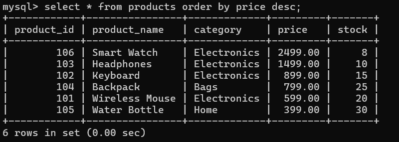 &nbsp;

---

### 9. Display the top 3 most expensive products.
Query:
select * from products order by price desc limit 3;

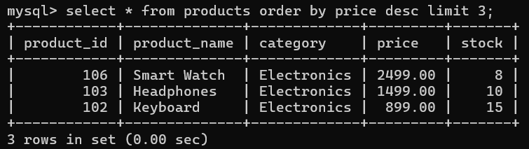 &nbsp;

---

### 10. Find the highest product price.
Query:
select max(price) as highest_price from products;

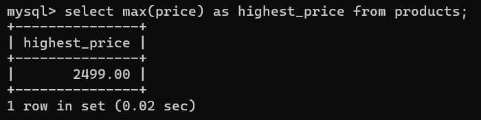 &nbsp;

---

### 11. Find the lowest product price.
Query:
select min(price) as lowest_price from products;

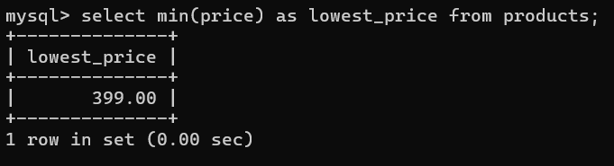 &nbsp;

---

### 12. Find the average price of all products.
Query:
select avg(price) as average_price from products;

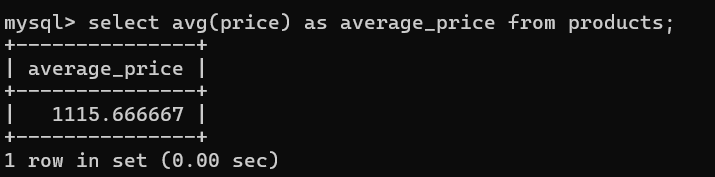 &nbsp;

---

### 13. Display the total number of products.
Query:
select count(*) as total_products from products;

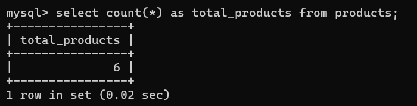 &nbsp;

---

### 14. Display the total stock available.
Query:
select sum(stock) as total_stock from products;

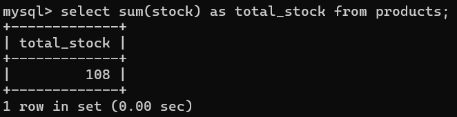 &nbsp;

---

### 15. Display the number of products in each category.
Query:
select category, count(*) as product_count from products group by category;

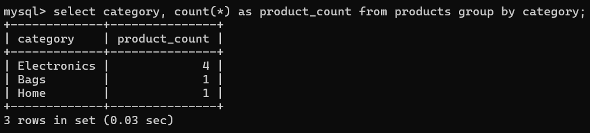 &nbsp;

---

### 16. Display the average price of products in each category.
Query:
select category, avg(price) as average_price from products group by category;

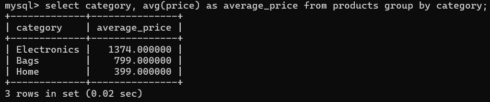 &nbsp;

---

### 17. Display all orders with an amount greater than 1500.
Query:
select * from orders where total_amount > 1500;

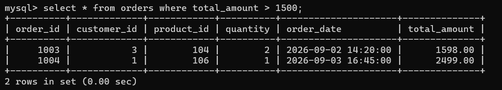 &nbsp;

---

### 18. Display orders made by customer 1.
Query:
select * from orders where customer_id = 1;

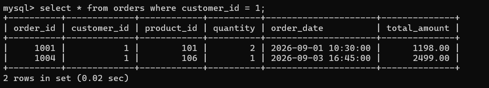 &nbsp;

---

### 19. Display the 3 orders having the highest total amount.
Query:
select * from orders order by total_amount desc limit 3;

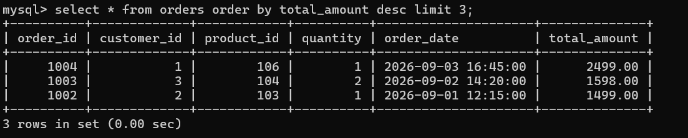 &nbsp;

---

### 20. Find the total sales amount.
Query:
select sum(total_amount) as total_sales from orders;

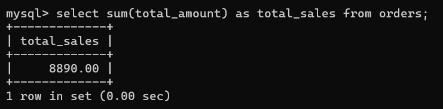 &nbsp;

---

### 21. Display the customer names along with their order details.
Query:
select c.customer_name, o.order_id, o.order_date, o.total_amount from customers as c join orders as o on c.customer_id = o.customer_id;

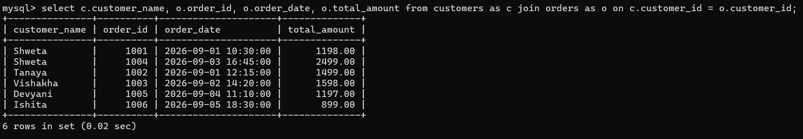 &nbsp;

---

### 22. Display customer name, product name and quantity ordered.
Query:
select c.customer_name, p.product_name, o.quantity from customers c join orders o on c.customer_id = o.customer_id join products p on o.product_id = p.product_id;

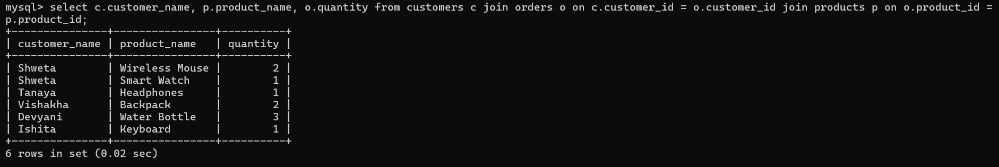 &nbsp;

---

### 23. Display customer name, product name and total amount of each order.
Query:
select c.customer_name, p.product_name, o.total_amount from customers c join orders o on c.customer_id = o.customer_id join products p on o.product_id = p.product_id;

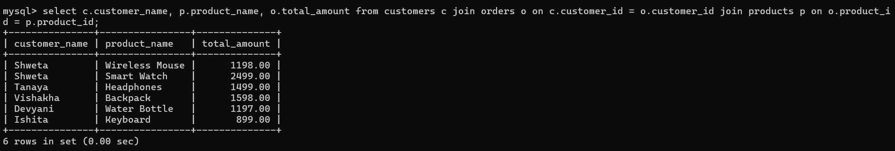 &nbsp;

---

### 24. Display all orders along with the corresponding product names.
Query:
select o.order_id, p.product_name, o.quantity, o.total_amount from orders o join products p on o.product_id = p.product_id;

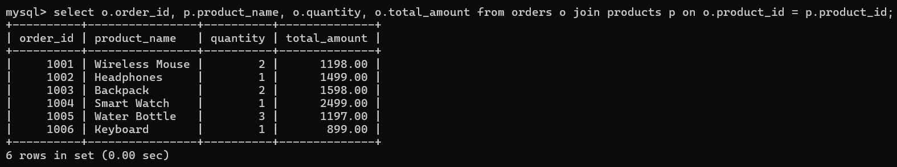 &nbsp;

---
### 25. Display customer names and their payment details.
Query:
select c.customer_name, p.payment_method, p.payment_amount, p.payment_status from customers c join orders o on c.customer_id = o.customer_id join payments p on o.order_id = p.order_id;

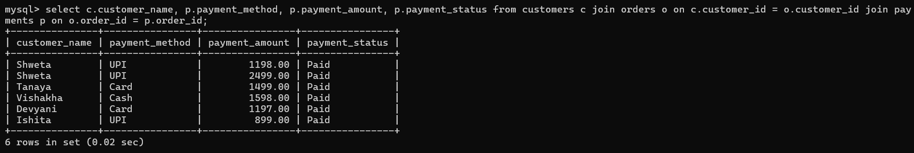 &nbsp;

---

### 26. Display the number of orders made by each customer.
Query:
select c.customer_id, c.customer_name, count(o.order_id) as number_of_orders from customers c left join orders o on c.customer_id = o.customer_id group by c.customer_id, c.customer_name;

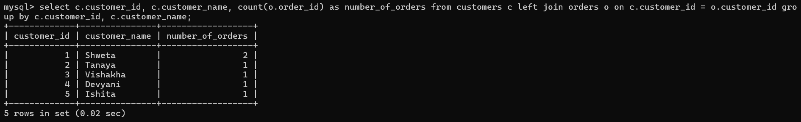 &nbsp;

---

### 27. Display the total amount spent by each customer.
Query:
select c.customer_id, c.customer_name, sum(o.total_amount) as total_spent from customers c join orders o on c.customer_id = o.customer_id group by c.customer_id, c.customer_name;

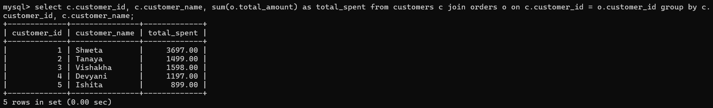 &nbsp;

---

### 28. Display customers whose total spending is greater than 2000.
Query:
select c.customer_name, sum(o.total_amount) as total_spent from customers c join orders o on c.customer_id = o.customer_id group by c.customer_id, c.customer_name having sum(o.total_amount) > 2000;

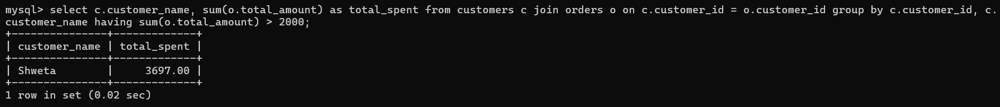 &nbsp;

---

### 29. Display the most recent order.
Query:
select * from orders order by order_date desc limit 1;

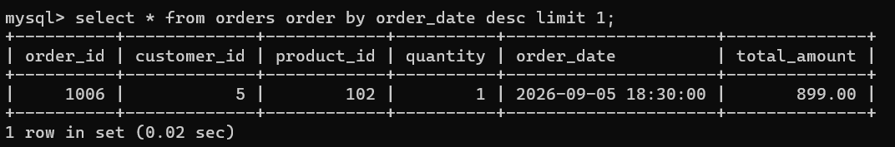 &nbsp;

---

### 30. Display the earliest and latest order dates.
Query:
select min(order_date) as earliest_order, max(order_date) as latest_order from orders;

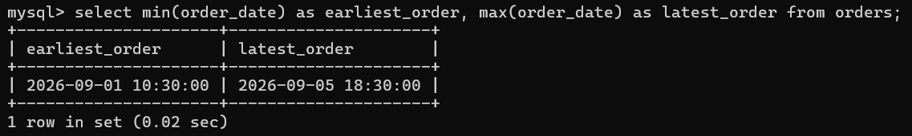 &nbsp;

---

### 31. Display the number of orders for each product.
Query:
select p.product_name, count(o.order_id) as number_of_orders from products p left join orders o on p.product_id = o.product_id group by p.product_id, p.product_name;

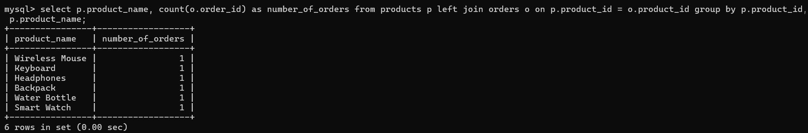 &nbsp;

---

### 32. Display the total quantity sold for each product.
Query:
select p.product_name, sum(o.quantity) as total_quantity_sold from products p join orders o on p.product_id = o.product_id group by p.product_id, p.product_name;

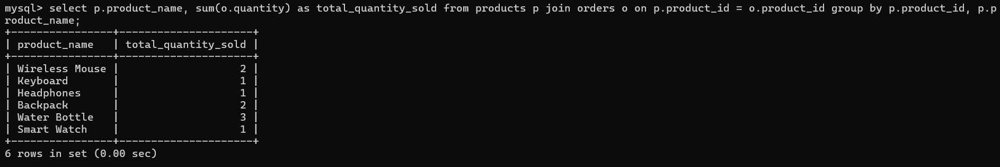 &nbsp;

---

### 33. Display the product that has been ordered in the highest quantity.
Query:
select p.product_name, sum(o.quantity) as total_quantity from products p join orders o on p.product_id = o.product_id group by p.product_id, p.product_name order by total_quantity desc limit 1;

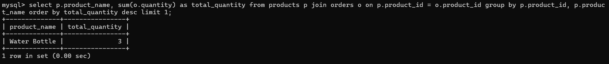 &nbsp;

--- 

### 34. Display all payments made using UPI.
Query:
select * from payments where payment_method = 'upi';

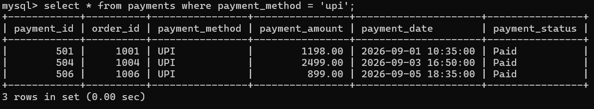 &nbsp;

---

### 35. Display all payments made using Card.
Query:
select * from payments where payment_method = 'card';

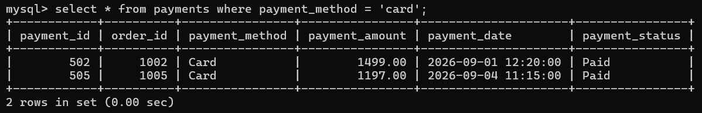 &nbsp;

---

### 36. Display the total payment amount for each payment method.
Query:
select payment_method, sum(payment_amount) as total_payment from payments group by payment_method;

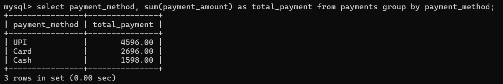 &nbsp;

---

### 37. Display the number of payments made using each payment method.
Query:
select payment_method, count(*) as number_of_payments from payments group by payment_method;

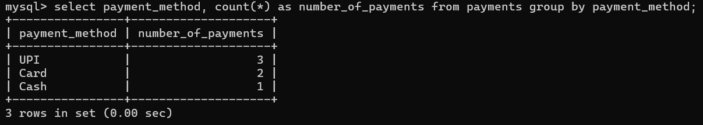 &nbsp;

---

### 38. Display orders along with their payment status.
Query:
select o.order_id, o.total_amount, p.payment_method, p.payment_status from orders o join payments p on o.order_id = p.order_id;

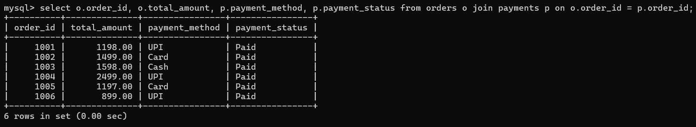 &nbsp;

---

### 39. Display customers who have placed an order for a Smart Watch.
Query:
select c.customer_name, p.product_name from customers c join orders o on c.customer_id = o.customer_id join products p on o.product_id = p.product_id where p.product_name = 'smart watch';

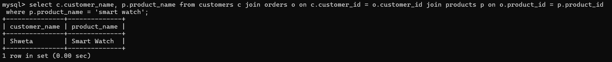 &nbsp;

---

### 40. Display the customer who spent the highest total amount.
Query:
select c.customer_name, sum(o.total_amount) as total_spent from customers c join orders o on c.customer_id = o.customer_id group by c.customer_id, c.customer_name order by total_spent desc limit 1;

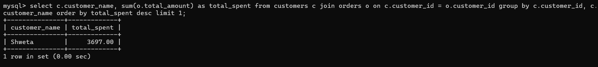 &nbsp;

---

### 41. Display the customer who placed the maximum number of orders.
Query:
select c.customer_name, count(o.order_id) as total_orders from customers c join orders o on c.customer_id = o.customer_id group by c.customer_id, c.customer_name order by total_orders desc limit 1;

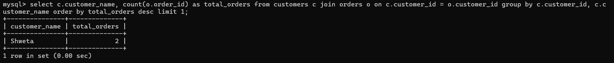 &nbsp;

---

### 42. Display the product that generated the highest sales amount.
Query:
select p.product_name, sum(o.total_amount) as total_sales from products p join orders o on p.product_id = o.product_id group by p.product_id, p.product_name order by total_sales desc limit 1;

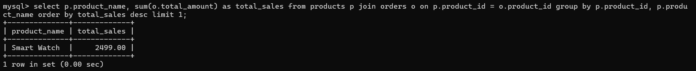 &nbsp;

---

### 43. Display the customer who placed the most expensive single order.
Query:
select c.customer_name, o.order_id, o.total_amount from customers c join orders o on c.customer_id = o.customer_id order by o.total_amount desc limit 1;

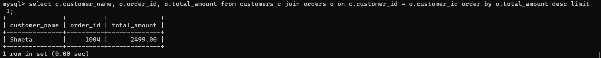 &nbsp;

---

### 44. Display the product with the lowest stock.
Query:
select product_name, stock from products order by stock asc limit 1;

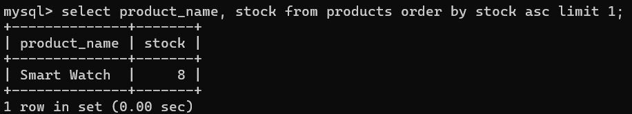 &nbsp;

---

### 45. Display the product with the highest stock.
Query:
select product_name, stock from products order by stock desc limit 1;

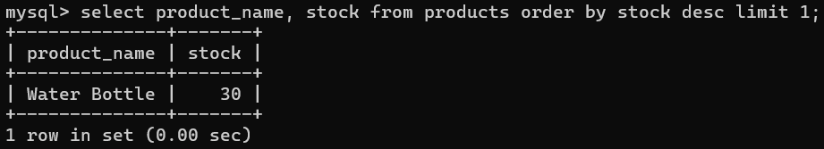 &nbsp;

---

### 46. Display the customer who made the earliest order.
Query:
select c.customer_name, o.order_id, o.order_date from customers c join orders o on c.customer_id = o.customer_id order by o.order_date asc limit 1;

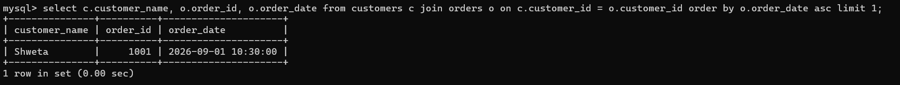 &nbsp;

---

### 47. Display the customer who made the most recent order.
Query:
select c.customer_name, o.order_id, o.order_date from customers c join orders o on c.customer_id = o.customer_id order by o.order_date desc limit 1;

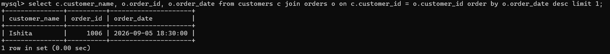 &nbsp;

---

### 48. Display the payment with the highest payment amount.
Query:
select * from payments order by payment_amount desc limit 1;

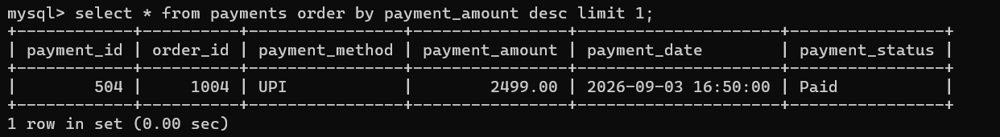 &nbsp;

---

### 49. Display the payment method used for the highest order amount.
Query:
select o.order_id, o.total_amount, p.payment_method from orders o join payments p on o.order_id = p.order_id order by o.total_amount desc limit 1;

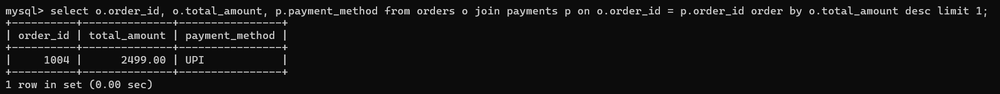 &nbsp;

---

### 50. Display the customer who purchased the highest quantity of products.
Query:
select c.customer_name, sum(o.quantity) as total_quantity from customers c join orders o on c.customer_id = o.customer_id group by c.customer_id, c.customer_name order by total_quantity desc limit 1;

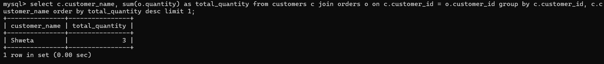 &nbsp;

---

## Working of the System
- Customers register their details in the customers table. 
- Products available for purchase are stored in the products table. 
- Customers place orders, which are recorded in the orders table. 
- Each order contains the customer, product, quantity, order date, and total amount. 
- Payments made for orders are recorded in the payments table. 
- SQL queries are used to generate reports and analyze shopping data. 

---

## Advantages
- Organized relational structure for efficient data management. 
- Maintains relationships between customers, products, orders, and payments. 
- Demonstrates understanding of primary keys and foreign keys. 
- Makes it easy to retrieve and analyze shopping information. 
- Suitable for students learning SQL through a real-world e-commerce model. 

---

## Limitations
- Product stock is not automatically updated after an order. 
- The system does not include an automatic refund management feature. 
- No delivery or shipment tracking is included. 
- No GUI interface is provided; the database is operated using SQL commands. 

--- 

## Future Scope
- Add automatic stock updates using triggers. 
- Add a delivery and shipment tracking table. 
- Implement refund and cancellation management. 
- Add customer login and authentication. 
- Introduce stored procedures for order and payment operations. 
- Build a web or GUI-based online shopping application. 

---

## Conclusion
The Online Shop Management System Database is a relational SQL project that demonstrates important database concepts through a real-world online shopping model. It efficiently manages customers, products, orders, and payments while demonstrating the use of relationships, foreign keys, joins, aggregate functions, and SQL queries for data analysis.
The project provides a strong foundation for understanding how databases can be used to manage and analyze the operations of an online shopping system.

